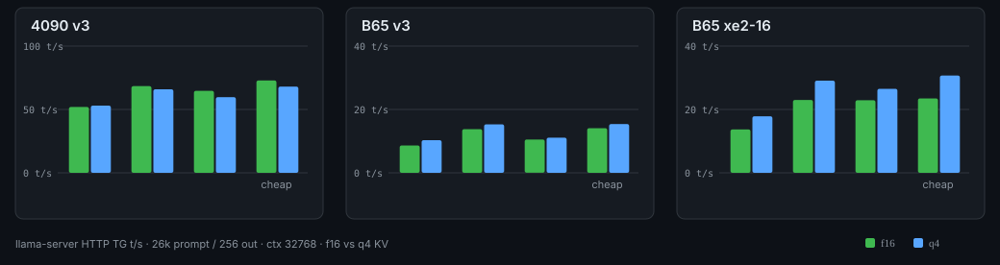

# llama.cpp-exl3xe2cuda

Fork of [llama.cpp](https://github.com/ggml-org/llama.cpp) at `74a7c897f`.
EXL3 GGUFs on NVIDIA CUDA and Intel Xe2 SYCL. Normal Q/IQ GGUFs on the same
binaries. Xe2 dGPU (Arc Pro B65 class) gets extra decode speed on those
quants. MTP: `--spec-type draft-mtp`.

Not affiliated with ggml-org or Turboderp. Not an upstream PR.

## Built for

- EXL3 CUDA: NVIDIA sm_86 and sm_89 only. Proven on RTX 4090. A 3090-class
  card should load the same cubins; untested here. Older NVIDIA has no cubin.
  5090 (sm_120) is not in this fatbin.
- EXL3 SYCL: Intel Xe2 (`bmg_g21` / `bmg_g31`, Arc Pro B65, B70 might/should be compatible). Lunar Lake can
  load EXL3. A770/PVC do not get EXL3 kernels. `GGML_SYCL_EXL3=0` forces off.
- Xe2 extras (IQ4/Q4 ESIMD, GDN COL2, fused RMS/gate): Battlemage dGPU only.
  Lunar Lake stays on stock SYCL. An A770 does not eat B65 defaults.
- AMD: stock ggml-vulkan in `build-vulkan` (R9700 / RADV). Q/IQ only. No EXL3.

## Three binaries

Same source. icpx cannot be the CUDA compiler. No EXL3 on Vulkan (yet).

```
# NVIDIA: EXL3 + Q/IQ
cmake -S . -B build-cuda -G Ninja -DGGML_CUDA=ON -DGGML_VULKAN=OFF \
  -DCMAKE_CUDA_ARCHITECTURES="86;89"
cmake --build build-cuda

# Intel Xe2 SYCL: EXL3 + Q/IQ (Xe2 extras on B65)
cmake -S . -B build-sycl -G Ninja -DGGML_SYCL=ON -DCMAKE_CXX_COMPILER=icpx
cmake --build build-sycl

# AMD (R9700 etc.): Q/IQ only, stock ggml-vulkan. No EXL3.
cmake -S . -B build-vulkan -G Ninja -DGGML_VULKAN=ON -DGGML_CUDA=OFF
cmake --build build-vulkan
```

## Convert ExLlamaV3 safetensors to GGUF

You need a packed EXL3 folder from ExLlamaV3 `convert.py` first (CUDA encode).
This repo does not run that Viterbi. Then, in this tree:

```
PYTHONPATH=./gguf-py python3 convert_hf_to_gguf.py <exl3-dir> --outtype auto
```

`--no-nextn` drops MTP. Vision: add `--mmproj --outtype f16`, then
`llama-quantize` the mmproj to Q8_0 if you want.

Quality pack is v3 MMA (`exl3.pack` v3). It loads on CUDA and Xe2 SYCL.

GGUFs (skip the convert if you just want to run):
https://huggingface.co/cesarsal1nas/Qwen3.8-27B-EXL3-GGUF
v3 is the quality default. xe2-16 is B65-only (CUDA aborts).

## Numbers (this GGUF, this box)

File: `Qwen3.8-27B-EXL3-11.5GB-text-mtp-v3.gguf`, packed EXL3 from
GestaltLabs/Qwen3.8-27B-EXL3-11.5GB (Qwen3.8-27B, ~2.87 bpw, MTP).
In-tree GGUF convert only. Encode (Viterbi) was ExLlamaV3 `convert.py` on the
4090. Not a B65 encode.

PPL `llama-perplexity` wiki.test.raw 16x2048 on that v3 GGUF: 6.42 (CUDA).

llama-server HTTP, same LONG_PROMPT, ctx 32768, -b/-ub 2048.

```
4090 CUDA0 v3               prompt 26176 @ 1996 t/s, 256 @ 52.0 t/s
4090 CUDA0 v3 draft-mtp     prompt 26176 @ 1895 t/s, 256 @ 64.7 t/s (n-max=2 p-min=0.55, draft 155/176)
4090 CUDA0 v3 cheap p-min=0.35
                            prompt 26176 @ 1900 t/s, 256 @ 72.9 t/s (n-max=1, draft 118/135)
B65 SYCL0 v3 f16            prompt 26176 @ 876 t/s,  256 @ 8.65 t/s
B65 SYCL0 v3 q4 n-max=2     prompt 26176 @ 819 t/s,  256 @ 11.1 t/s (draft 153/175)
B65 SYCL0 xe2-16 f16        prompt 26176 @ 904 t/s,  256 @ 13.7 t/s (xe2-16 pack, CUDA aborts)
B65 SYCL0 xe2-16 q4 n-max=2 prompt 26176 @ 836 t/s,  256 @ 26.5 t/s (draft 153/172)
B65 SYCL0 xe2-16 q4 cheap p-min=0.35
                            prompt 26176 @ 836 t/s,  256 @ 30.7 t/s (draft 122/133; xe2-16 pack, CUDA aborts)
```

HTTP generate TG (f16 vs q4 KV). Same 26k/256 cell. B65 v3 is the quality pack on Intel, not the speed pack.



llama-cli greedy Test HTML (not HTTP), ctx 8192, EOS:

```
4090 CUDA0 v3            Prompt 774.2  Generation 57.5 t/s
4090 CUDA0 v3 n-max=2    Prompt 603.8  Generation 65.7 t/s
4090 CUDA0 v3 cheap 0.35 Prompt 549.1  Generation 77.6 t/s
B65 SYCL0 v3             Prompt 125.5  Generation 10.4 t/s
B65 SYCL0 xe2-16         Prompt 152.1  Generation 18.8 t/s  (xe2-16 pack, CUDA aborts)
B65 SYCL0 xe2-16 q4 cheap 0.35
                         Prompt 145.6  Generation 32.2 t/s  (xe2-16 pack, CUDA aborts)
```

Those rates are this model and this prompt. Another GGUF will differ.
llama-bench is synthetic; not the card.

ExLlamaV3 1.4.8, same 4090, GestaltLabs safetensors (not the GGUF):
tight-loop TG ctx0 62.1, PP512 1866, PP2048 2477.
LONG_PROMPT 256 out: plain TG 53.7 (llama.cpp no-MTP 52.0). ExL MTP n=1 TG 84.0
(llama.cpp --spec-mtp-cheap p-min 0.35 is 72.9). ExL MTP n=2 TG 39.0 (llama.cpp n-max=2 64.7).

## MTP (two modes, same verify)

Both check drafts against the target. Cheap is not a skip-verify path.

Default, longer draft:

```
--spec-type draft-mtp --spec-draft-n-max 2 --spec-draft-p-min 0.55
```

4090 HTTP 256 @ 64.7 t/s (draft 155/176).

Cheap / ExL-style one extra MTP token (INT8 M=2, one launch, shared B):

```
--spec-type draft-mtp --spec-mtp-cheap --spec-draft-p-min 0.35
```

Forces n-max=1. Same greedy target check. 4090 HTTP 256 @ 72.9 t/s (draft 118/135), PP 1900.
MTP n_ubatch follows target (-ub 2048). Do not set n_ubatch=1. n-max=2 is unchanged (M=3 still one INT8 launch per row). ExL n=1 is 84 on the
same prompt (their q=2 kernel plus fused MTP). This flag does not skip verify.

## B65 / Xe2 (B70 probably?)

Two different things. Do not mix them.

1. Xe2 extras (normal Q/IQ GGUFs, not EXL3)

Battlemage dGPU only (`bmg_g21` / `bmg_g31`). Lunar Lake and A770 stay on stock
SYCL. IQ4/Q4 ESIMD GEMV, FA ESIMD, GDN COL2 (prefill, n_tokens>=16), fused GDN
gate and ADD+RMS, L0 H2D upload. Leave `GGML_SYCL_*` unset on a B65.

These do not make v3 EXL3 decode fast. v3 on B65 is the HTTP cell above (~9 TG).

Qwopus3.8-27B-Flash-MTP on spare B65, extras unset, llama-server HTTP
(same LONG_PROMPT, ctx 32768, q4_0 KV, draft-mtp n-max=1):

```
ONEAPI_DEVICE_SELECTOR=level_zero:1
./build-sycl/bin/llama-server --device SYCL0 -m <gguf> -ngl 99 \
  --flash-attn on --fit off --parallel 1 --ctx-size 32768 \
  -b 2048 --ubatch-size 2048 --cache-type-k q4_0 --cache-type-v q4_0 \
  --spec-type draft-mtp --spec-draft-n-max 1 \
  --host 127.0.0.1 --port 8080
```

```
IQ4_XS  prompt 26173 @ 535 t/s, 256 @ 28.6 t/s, draft 94/161
Q4_K_M  prompt 26173 @ 566 t/s, 256 @ 34.8 t/s, draft 121/133
```

llama-cli Paris n=64 (not HTTP): IQ4_XS 25.3 TG, Q4_K_M 25.8 TG.

2. Optional EXL3 speed pack (`exl3.pack=xe2-16`)

EXL3 tiles overlap along the encode ring. v3 walks FragB/MMA (CUDA+SYCL).
xe2-16 walks K-columns (B65 SYCL). One trellis cannot feed both walks. CUDA
`GGML_ABORT`s xe2-16. PPL on a rematerialize of the same GestaltLabs weights:
6.62 vs v3 6.42.

Spare B65, `llama-speculative-simple`, Paris n=128, not the LONG_PROMPT HTTP cell:

```
greedy no MTP   17.5 t/s
MTP n-max=1     34.8 t/s
MTP n-max=2     30.4 t/s
```

That is the ~30-35 TG number. Different GGUF. CUDA aborts it.

`convert_hf_to_gguf.py` only stamps `exl3.pack`. It does not walk K-columns.
To make xe2-16 safetensors from a v3 packed folder (CUDA + ExLlamaV3 installed):

```
python3 conversion/encode_exl3_xe2_from_what.py <v3-exl3-dir> <xe2-16-dir>
EXL3_PACK=xe2-16 PYTHONPATH=./gguf-py python3 convert_hf_to_gguf.py <xe2-16-dir> \
  --outtype auto
```

On GestaltLabs Qwen3.8-27B EXL3 that rematerialize was wiki PPL 6.62 vs v3 6.42.
Do not run ExLlama `convert.py` `EXL3_PACK=xe2-16` from dense BF16 expecting v3 PPL
(our first-gen was 8.71).

## Run

Quality EXL3 GGUF, 4090:

```
./build-cuda/bin/llama-server --device CUDA0 -m model.gguf -ngl 99 \
  --flash-attn on --port 8080
```

Draft-mtp on the server:

```
./build-cuda/bin/llama-server --device CUDA0 -m model.gguf -ngl 99 \
  --flash-attn on --spec-type draft-mtp --spec-draft-n-max 2 \
  --spec-draft-p-min 0.55 --port 8080
```

B65 SYCL (this box has 2x B65; GPU 0 is the display, numbers were run on the spare):

```
ONEAPI_DEVICE_SELECTOR=level_zero:1 ./build-sycl/bin/llama-server \
  --device SYCL0 -m model.gguf -ngl 99 --flash-attn on --port 8080
```

AMD R9700 Q/IQ (not EXL3). `--list-devices` and pick the RADV card:

```
./build-vulkan/bin/llama-server --device Vulkan0 -m q4.gguf -ngl 99 \
  --flash-attn on --port 8080
```

Q/IQ GGUFs load on all three binaries. EXL3 only on `build-cuda` and `build-sycl`.
Leave GGML_SYCL_* unset on B65.

## What we added

- EXL3 type, CUDA kernels (from ExLlamaV3), SYCL kernels, converter
- draft-mtp (n-max=1/2). n-max=3 is WIP, not in this tree
- Xe2 extras and xe2-16 pack: see B65 / Xe2 above

Not in this tree: Vulkan EXL3.

## License

- llama.cpp / ggml: MIT, The ggml authors. See `LICENSE`.
- EXL3 CUDA kernels in `ggml/src/ggml-cuda/exl3/`: derived from
  [ExLlamaV3](https://github.com/turboderp-org/exllamav3), MIT,
  Copyright 2025 Turboderp. See `licenses/LICENSE-exllamav3` and `NOTICE`.
- `exl3.cu` / `exl3.cuh` / `exl3_moe.cuh` are ggml glue / ours, not Turboderp.

Keep those notices if you copy this tree.

EXL3 is Turboderp's packed trellis format (QTIP-style). This repo does not
include QTIP paper code or ik_llama.cpp `IQ*_KT`.
